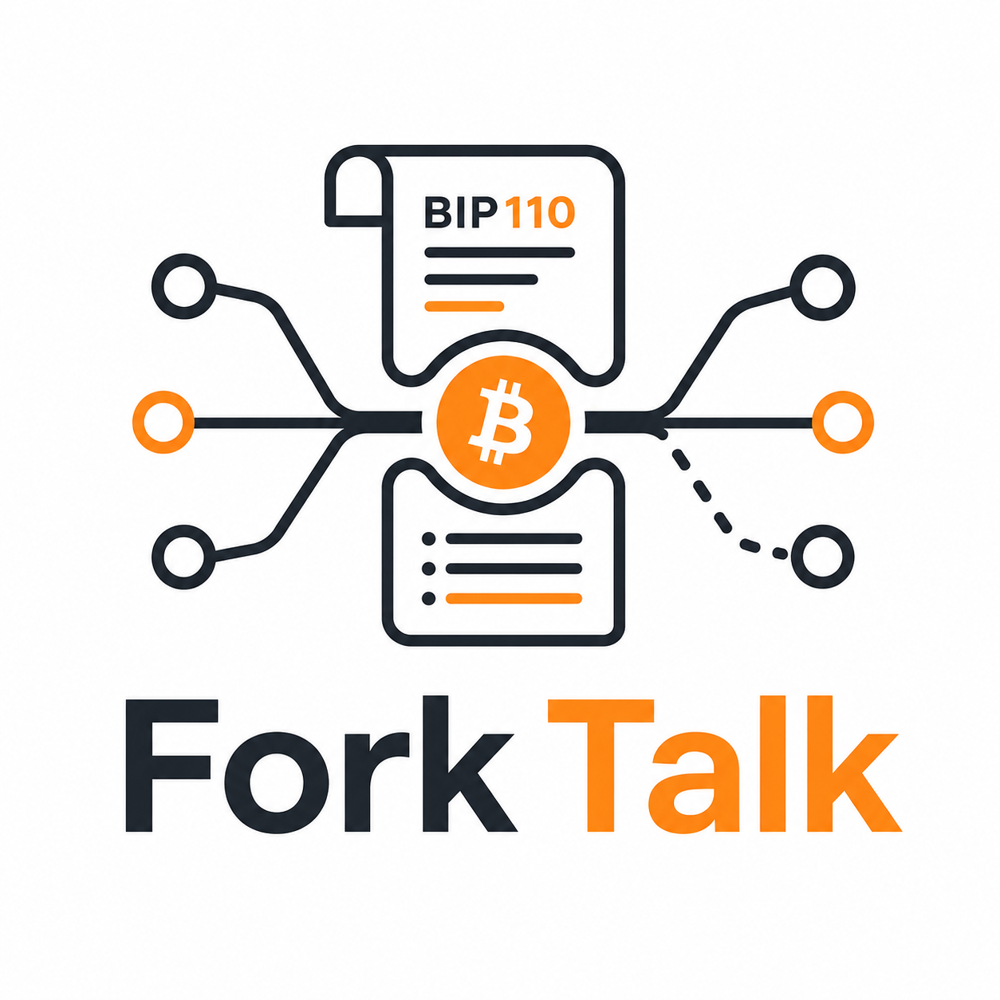

  

# Bitcoin Forks FAQ

A beginner-friendly guide to Bitcoin forks - what they are, what types exist, and what's being discussed today.

---

## Quick Definitions

- **Fork** - A change to Bitcoin's rules. Can be routine (everyone agrees) or contentious (they don't).
- **Soft fork** - Tightens rules. Backward-compatible. Non-upgraded nodes still follow the chain.
- **Hard fork** - Changes rules in ways old nodes reject. Can cause permanent chain splits.
- **Temporary soft fork** - A soft fork with a built-in expiry date.
- **BIP** - Bitcoin Improvement Proposal. The standard format for proposing changes. Anyone can write one. [Full list](https://github.com/bitcoin/bips)
- **UASF** - User-Activated Soft Fork. Activated by node operators on a flag day, not by miner signaling.
- **MASF** - Miner-Activated Soft Fork. Activated when a threshold of blocks signal support (historically 90-95%).
- **Activation threshold** - The percentage of blocks that must signal support before new rules take effect.
- **Nakamoto consensus** - Bitcoin's majority-rule mechanism ([white paper, section 6](https://bitcoin.org/bitcoin.pdf)). Proof-of-work and the longest-chain rule create economic incentives for convergence.

---

## Historical Soft Forks

Every soft fork in Bitcoin's history has resulted in network convergence - no chain splits.

| Year | Fork | Type | What it did |
|------|------|------|-------------|
| 2012 | [P2SH (BIP-16)](forks/p2sh.md) | MASF | Pay-to-script-hash for complex spending conditions |
| 2012 | [BIP-34](forks/bip34.md) | MASF | Block height in coinbase transactions |
| 2015 | [CLTV (BIP-65)](forks/cltv.md) | MASF | Absolute time locks |
| 2015 | [BIP-66](forks/bip66.md) | MASF | Strict DER signature encoding |
| 2016 | [CSV (BIP-68/112/113)](forks/csv.md) | MASF | Relative time locks |
| 2017 | [SegWit (BIP-141)](forks/segwit.md) | UASF/MASF | Witness separation, malleability fix, capacity increase |
| 2021 | [Taproot (BIP-340/341/342)](forks/taproot.md) | MASF | Schnorr signatures, MAST, improved privacy |

---

## Historical Hard Forks

Hard forks without overwhelming consensus create permanent chain splits.

| Year | Fork | What happened |
|------|------|--------------|
| 2017 | [Bitcoin Cash (BCH)](forks/bitcoin-cash.md) | Increased block size to 8 MB. Permanent split. |
| 2017 | [Bitcoin Gold (BTG)](forks/bitcoin-gold.md) | Changed PoW to Equihash. Permanent split. |
| 2018 | [Bitcoin SV (BSV)](forks/bitcoin-sv.md) | Split from BCH, block size to 128 MB. |

---

## Current Proposals

| Proposal | Type | Status |
|----------|------|--------|
| [BIP-110](forks/bip-110.md) | Temporary soft fork | Proposed - data-reduction rules, auto-expires ~1 year |
| [eCash](forks/ecash.md) | Fork proposal | Proposed - see [ecash.com](https://ecash.com) |

Other active discussions: [OP_CTV (BIP-119)](https://github.com/bitcoin/bips/blob/master/bip-0119.mediawiki), [OP_CAT (BIP-347)](https://github.com/bitcoin/bips/blob/master/bip-0347.mediawiki), Great Consensus Cleanup.

---

## Getting Involved

- **Run a node** - The most direct way to participate in Bitcoin governance
- **Contribute data** - Empirical analysis is more valuable than opinion
- **Submit PRs** - Improve this FAQ, correct errors, add sources
- **Open issues** - Suggest questions or flag inaccuracies

## Learn More

- [Bitcoin white paper](https://bitcoin.org/bitcoin.pdf) - The founding document
- [BIP repository](https://github.com/bitcoin/bips) - All proposals
- [bip110.org](https://bip110.org/) - BIP-110 community hub, installation guides, FAQ
- [Bitcoin Block Space Weekly](https://blockspaceweekly.substack.com/) - Empirical block space analysis (Renaud Cuny)
- [fork-talk GitHub org](https://github.com/fork-talk)

---

*Community effort. Does not represent any individual or organization. Corrections welcome via PR.*
